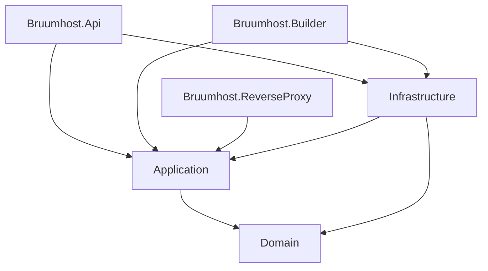
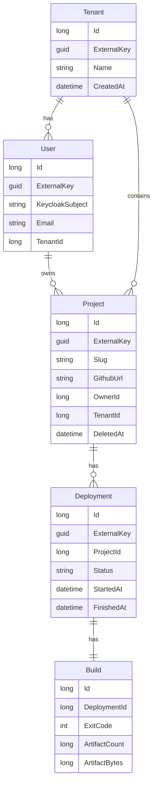
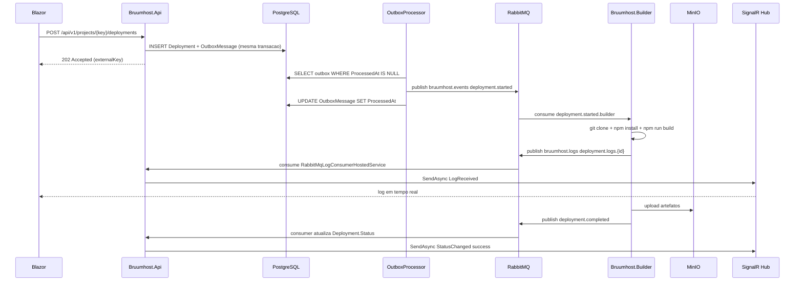

# Plano de Migracao do BruumHost para o stack ArecoID

> Guia de estudo pratico e progressivo para reescrever o BruumHost (https://github.com/LeonardoBrum0907/bruumhost) usando o stack tecnologico do projeto ArecoID descrito em `guia-estudo-arecoid.md`.
>
> Stack alvo: .NET 9 / C#, ASP.NET Core, Entity Framework Core, PostgreSQL, Keycloak, RabbitMQ, MinIO, Blazor WebAssembly. Padroes: Clean Architecture, DDD, CQRS, Outbox Pattern, Result Pattern, Vertical Slices.

---

## Indice

1. [Visao geral e mapeamento de stack](#1-visao-geral-e-mapeamento-de-stack)
2. [Estrutura da nova solucao .NET](#2-estrutura-da-nova-solucao-net)
3. [Modelagem de dominio](#3-modelagem-de-dominio)
4. [Fluxo end-to-end de um deploy](#4-fluxo-end-to-end-de-um-deploy)
5. [Fase 0 - Setup inicial](#fase-0---setup-inicial)
6. [Fase 1 - Domain Layer](#fase-1---domain-layer)
7. [Fase 2 - Application Layer (CQRS)](#fase-2---application-layer-cqrs)
8. [Fase 3 - Infrastructure: EF Core + Outbox](#fase-3---infrastructure-ef-core--outbox)
9. [Fase 4 - Infrastructure: RabbitMQ + Outbox dispatcher](#fase-4---infrastructure-rabbitmq--outbox-dispatcher)
10. [Fase 5 - Infrastructure: MinIO + Keycloak](#fase-5---infrastructure-minio--keycloak)
11. [Fase 6 - API Layer](#fase-6---api-layer)
12. [Fase 7 - API Layer: SignalR](#fase-7---api-layer-signalr)
13. [Fase 8 - Builder em .NET](#fase-8---builder-em-net)
14. [Fase 9 - Reverse Proxy com YARP](#fase-9---reverse-proxy-com-yarp)
15. [Fase 10 - Frontend Blazor WebAssembly](#fase-10---frontend-blazor-webassembly)
16. [Fase 11 - Testes](#fase-11---testes)
17. [Fase 12 - Docker Compose final + CI/CD](#fase-12---docker-compose-final--cicd)
18. [Features novas que justificam o stack](#features-novas-que-justificam-o-stack)
19. [Obstaculos criticos e solucoes](#obstaculos-criticos-e-solucoes)
20. [Ordem sugerida de estudo + checklist](#ordem-sugerida-de-estudo--checklist)

---

## 1. Visao geral e mapeamento de stack

A tabela abaixo mostra cada peca do BruumHost atual e o equivalente no stack ArecoID. Ela e o primeiro mapa mental que voce deve formar antes de escrever uma linha de C#.

| Peca atual (Node.js) | Onde fica hoje | Equivalente .NET / Areco | Padrao do guia ArecoID |
| --- | --- | --- | --- |
| Express + Socket.io | `api-server/src/index.ts` | ASP.NET Core Web API + SignalR Hub | Secoes 6, 17 |
| Redis pub/sub para logs | `builder/src/infrastructure/redis-log-publisher.ts` | RabbitMQ exchange `bruumhost.logs` | Secao 14 |
| Redis key-value (TTL de projeto) | `api-server/src/services/cleanup.ts` | PostgreSQL + EF Core | Secao 9 |
| Builder Node script em container | `builder/src/index.ts` | .NET 9 Worker Service em container (com Node instalado) | Secao 5 (Infra) |
| Reverse Proxy Express + MinIO | `reverse-proxy/index.ts` | ASP.NET Core + YARP + AWS SDK S3 | Secao 6 |
| Frontend React + Vite + Three.js | `frontend/src/App.tsx` | Blazor WebAssembly + Three.js via JS interop | - |
| Sem autenticacao | (anonimo) | Keycloak (OIDC + JWT Bearer) | Secao 13 |
| Sem mensageria persistente | (Redis pub/sub volatil) | RabbitMQ + Outbox Pattern | Secoes 14, 15 |
| Sem persistencia relacional | (so Redis) | PostgreSQL + EF Core + migrations | Secao 9 |
| Sem testes em camadas | Jest em `__tests__` | xUnit + FluentAssertions + Testcontainers | - |

### Por que adicionar tantas pecas

O bruumhost atual e enxuto. Para exercitar **todos** os topicos do guia ArecoID, precisamos introduzir conceitos que nao existem na versao Node:

- **Banco relacional** para exercitar EF Core, migrations, soft delete, auditoria (secoes 9, 10, 11).
- **Keycloak** para exercitar JWT, OIDC, refresh token, roles (secao 13).
- **RabbitMQ + Outbox** para exercitar mensageria assincrona e consistencia eventual (secoes 14, 15).
- **CQRS com dispatcher proprio** para entender por dentro o que MediatR faz (secao 4).
- **Result Pattern** para sair de exceptions e modelar erros como dados (secao 8).

---

## 2. Estrutura da nova solucao .NET

```
Bruumhost.sln
|-- src/
|   |-- Bruumhost.Domain/             -> entities, VOs, BaseEntity, Result, Errors
|   |-- Bruumhost.Application/        -> Commands, Queries, Handlers, Dispatcher, ports
|   |-- Bruumhost.Infrastructure/     -> EF Core, Outbox, RabbitMQ, MinIO, Keycloak
|   |-- Bruumhost.Api/                -> Controllers, SignalR Hubs, Middleware, Auth
|   |-- Bruumhost.Builder/            -> Worker Service (consome RabbitMQ, roda build)
|   |-- Bruumhost.ReverseProxy/       -> YARP + serve arquivos do MinIO
|   |-- Bruumhost.Frontend/           -> Blazor WebAssembly
|   `-- Bruumhost.Contracts/          -> DTOs e contratos de mensagem (compartilhado)
|-- tests/
|   |-- Bruumhost.Domain.Tests/
|   |-- Bruumhost.Application.Tests/
|   |-- Bruumhost.Infrastructure.Tests/
|   `-- Bruumhost.Api.Tests/
`-- docker/
    |-- docker-compose.yml
    |-- keycloak-realm.json
    `-- postgres-init.sql
```

### Regras de dependencia (DIP - Secao 19)



- `Domain` nao referencia ninguem.
- `Application` referencia so `Domain`.
- `Infrastructure` referencia `Domain` e `Application` (implementa as ports).
- Hosts (`Api`, `Builder`, `ReverseProxy`) compoem tudo via DI.

---

## 3. Modelagem de dominio

Antes de escrever codigo, modele as entidades. Para o BruumHost, o dominio principal e:

- **User**: pessoa autenticada via Keycloak.
- **Tenant**: organizacao a qual o usuario pertence (multi-tenancy basico).
- **Project**: configuracao de um repositorio GitHub que pode ser deployado.
- **Deployment**: tentativa de deploy de um Project (sucesso, falha, em andamento).
- **Build**: detalhes tecnicos da execucao (logs, artefatos, tempos).
- **OutboxMessage**: mensagem pendente de publicacao no RabbitMQ.

### Diagrama de entidades



### Value Objects sugeridos

- `GitHubRepositoryUrl`: encapsula validacao da URL (regex, https, dominio github.com).
- `ProjectSlug`: encapsula geracao + validacao do slug (replicar `random-word-slugs`).
- `PreviewUrl`: derivado de slug + dominio + protocolo.
- `Email`: validacao de e-mail.

---

## 4. Fluxo end-to-end de um deploy



---

## Fase 0 - Setup inicial

**Objetivo:** preparar o terreno antes de escrever uma unica entidade.

### Checklist

- [ ] Instalar .NET 9 SDK e EF Core CLI: `dotnet tool install --global dotnet-ef`.
- [ ] Criar a solucao: `dotnet new sln -n Bruumhost`.
- [ ] Criar os projetos da Fase 1-12 com `dotnet new classlib` / `dotnet new webapi` / `dotnet new worker` / `dotnet new blazorwasm`.
- [ ] Adicionar referencias respeitando as regras de dependencia da secao 2.
- [ ] Subir a infraestrutura via `docker-compose up -d`.

### docker-compose.yml inicial

```yaml
version: "3.9"
services:
  postgres:
    image: postgres:16-alpine
    environment:
      POSTGRES_USER: bruumhost
      POSTGRES_PASSWORD: bruumhost
      POSTGRES_DB: bruumhost
    ports: ["5432:5432"]
    volumes: [pgdata:/var/lib/postgresql/data]

  keycloak:
    image: quay.io/keycloak/keycloak:25.0
    command: start-dev --import-realm
    environment:
      KEYCLOAK_ADMIN: admin
      KEYCLOAK_ADMIN_PASSWORD: admin
    volumes:
      - ./keycloak-realm.json:/opt/keycloak/data/import/realm.json
    ports: ["8180:8080"]

  rabbitmq:
    image: rabbitmq:3.13-management-alpine
    ports: ["5672:5672", "15672:15672"]
    environment:
      RABBITMQ_DEFAULT_USER: bruumhost
      RABBITMQ_DEFAULT_PASS: bruumhost

  minio:
    image: minio/minio:latest
    command: server /data --console-address ":8081"
    environment:
      MINIO_ROOT_USER: minioadmin
      MINIO_ROOT_PASSWORD: minioadmin
    ports: ["8080:9000", "8081:8081"]
    volumes: [miniodata:/data]

volumes:
  pgdata:
  miniodata:
```

### Realm Keycloak (keycloak-realm.json - resumo)

- Realm: `bruumhost`.
- Clients: `bruumhost-api` (bearer-only), `bruumhost-frontend` (public, redirect URIs do Blazor).
- Roles: `admin`, `user`.
- Usuario inicial: `admin@bruumhost.test` com role `admin`.

---

## Fase 1 - Domain Layer

**Objetivo:** modelar o coracao do sistema sem nenhuma dependencia externa.

### BaseEntity (Secao 2 do guia ArecoID)

```csharp
namespace Bruumhost.Domain.Common;

public abstract class BaseEntity
{
    public long Id { get; protected set; }
    public Guid ExternalKey { get; protected set; } = Guid.CreateVersion7();
    public DateTime CreatedAt { get; protected set; }
    public string? CreatedBy { get; protected set; }
    public DateTime? UpdatedAt { get; protected set; }
    public string? UpdatedBy { get; protected set; }
    public DateTime? DeletedAt { get; protected set; }

    public bool IsDeleted => DeletedAt is not null;
    public void SoftDelete() => DeletedAt = DateTime.UtcNow;
}
```

### Result Pattern (Secao 8)

```csharp
namespace Bruumhost.Domain.Common;

public enum ErrorType { Validation, NotFound, Conflict, Unauthorized, Failure }

public sealed record Error(string Code, string Message, ErrorType Type)
{
    public static readonly Error None = new(string.Empty, string.Empty, ErrorType.Failure);
    public static Error NotFound(string code, string msg) => new(code, msg, ErrorType.NotFound);
    public static Error Validation(string code, string msg) => new(code, msg, ErrorType.Validation);
    public static Error Conflict(string code, string msg) => new(code, msg, ErrorType.Conflict);
}

public class Result
{
    protected Result(bool ok, Error error)
    {
        if (ok && error != Error.None) throw new InvalidOperationException();
        if (!ok && error == Error.None) throw new InvalidOperationException();
        IsSuccess = ok;
        Error = error;
    }

    public bool IsSuccess { get; }
    public bool IsFailure => !IsSuccess;
    public Error Error { get; }

    public static Result Success() => new(true, Error.None);
    public static Result Failure(Error e) => new(false, e);
    public static Result<T> Success<T>(T value) => new(value, true, Error.None);
    public static Result<T> Failure<T>(Error e) => new(default!, false, e);
}

public class Result<T> : Result
{
    private readonly T _value;
    internal Result(T value, bool ok, Error error) : base(ok, error) => _value = value;
    public T Value => IsSuccess ? _value : throw new InvalidOperationException("No value on failure");
}
```

### Exemplo de entidade: Project

```csharp
namespace Bruumhost.Domain.Projects;

public sealed class Project : BaseEntity
{
    public ProjectSlug Slug { get; private set; } = default!;
    public GitHubRepositoryUrl GithubUrl { get; private set; } = default!;
    public long OwnerId { get; private set; }
    public long TenantId { get; private set; }
    public ICollection<Deployment> Deployments { get; private set; } = new List<Deployment>();

    private Project() { }

    public static Result<Project> Create(GitHubRepositoryUrl url, ProjectSlug slug, long ownerId, long tenantId)
    {
        if (ownerId <= 0)
            return Result.Failure<Project>(Error.Validation("project.owner.invalid", "Owner invalido"));

        return Result.Success(new Project
        {
            Slug = slug,
            GithubUrl = url,
            OwnerId = ownerId,
            TenantId = tenantId,
            CreatedAt = DateTime.UtcNow
        });
    }

    public Result StartNewDeployment(out Deployment deployment)
    {
        deployment = Deployment.StartFor(this);
        Deployments.Add(deployment);
        return Result.Success();
    }
}
```

### Value Object exemplo

```csharp
namespace Bruumhost.Domain.Projects;

public sealed record GitHubRepositoryUrl
{
    public string Value { get; }

    private GitHubRepositoryUrl(string value) => Value = value;

    public static Result<GitHubRepositoryUrl> Create(string raw)
    {
        if (string.IsNullOrWhiteSpace(raw))
            return Result.Failure<GitHubRepositoryUrl>(Error.Validation("url.empty", "URL obrigatoria"));

        if (!Uri.TryCreate(raw, UriKind.Absolute, out var uri) ||
            uri.Scheme != "https" ||
            !uri.Host.EndsWith("github.com", StringComparison.OrdinalIgnoreCase))
        {
            return Result.Failure<GitHubRepositoryUrl>(Error.Validation("url.invalid", "URL invalida"));
        }

        return Result.Success(new GitHubRepositoryUrl(uri.ToString()));
    }
}
```

### Checklist da fase

- [ ] `BaseEntity`, `Error`, `Result`, `Result<T>`.
- [ ] `PagedResult<T>` com `Items`, `Total`, `Page`, `PageSize`.
- [ ] Entidades: `Tenant`, `User`, `Project`, `Deployment`, `Build`.
- [ ] VOs: `GitHubRepositoryUrl`, `ProjectSlug`, `PreviewUrl`, `Email`.
- [ ] Eventos de dominio: `DeploymentStartedEvent`, `DeploymentCompletedEvent`.

---

## Fase 2 - Application Layer (CQRS)

**Objetivo:** organizar casos de uso por feature (vertical slices, secao 3 do guia) e implementar dispatcher proprio.

### Estrutura de pastas

```
Bruumhost.Application/
|-- Common/
|   |-- ICommand.cs
|   |-- IQuery.cs
|   |-- IDispatcher.cs
|   `-- Dispatcher.cs
|-- Ports/
|   |-- IProjectRepository.cs
|   |-- IDeploymentRepository.cs
|   |-- IBuildOrchestrator.cs
|   |-- IEventPublisher.cs
|   `-- IUnitOfWork.cs
`-- Features/
    |-- Projects/
    |   |-- CreateProject/
    |   |   |-- CreateProjectCommand.cs
    |   |   `-- CreateProjectHandler.cs
    |   `-- ListProjects/
    |       |-- ListProjectsQuery.cs
    |       `-- ListProjectsHandler.cs
    `-- Deployments/
        |-- StartDeployment/
        `-- GetDeploymentStatus/
```

### Contratos basicos

```csharp
namespace Bruumhost.Application.Common;

public interface ICommand<TResponse> { }
public interface IQuery<TResponse> { }

public interface ICommandHandler<TCommand, TResponse>
    where TCommand : ICommand<TResponse>
{
    Task<Result<TResponse>> Handle(TCommand command, CancellationToken ct);
}

public interface IQueryHandler<TQuery, TResponse>
    where TQuery : IQuery<TResponse>
{
    Task<Result<TResponse>> Handle(TQuery query, CancellationToken ct);
}

public interface IDispatcher
{
    Task<Result<TResponse>> Send<TResponse>(ICommand<TResponse> command, CancellationToken ct = default);
    Task<Result<TResponse>> Send<TResponse>(IQuery<TResponse> query, CancellationToken ct = default);
}
```

### Dispatcher proprio (didatico)

```csharp
namespace Bruumhost.Application.Common;

public sealed class Dispatcher : IDispatcher
{
    private readonly IServiceProvider _provider;
    public Dispatcher(IServiceProvider provider) => _provider = provider;

    public async Task<Result<TResponse>> Send<TResponse>(ICommand<TResponse> command, CancellationToken ct)
    {
        var handlerType = typeof(ICommandHandler<,>).MakeGenericType(command.GetType(), typeof(TResponse));
        dynamic handler = _provider.GetRequiredService(handlerType);
        return await handler.Handle((dynamic)command, ct);
    }

    public async Task<Result<TResponse>> Send<TResponse>(IQuery<TResponse> query, CancellationToken ct)
    {
        var handlerType = typeof(IQueryHandler<,>).MakeGenericType(query.GetType(), typeof(TResponse));
        dynamic handler = _provider.GetRequiredService(handlerType);
        return await handler.Handle((dynamic)query, ct);
    }
}
```

> Observacao: depois de entender o padrao, voce pode trocar por **MediatR** com tres linhas no `Program.cs`. O importante e ter feito uma vez na mao.

### Exemplo: CreateProjectCommand

```csharp
namespace Bruumhost.Application.Features.Projects.CreateProject;

public sealed record CreateProjectCommand(
    string GithubUrl,
    string? Slug,
    long OwnerId,
    long TenantId
) : ICommand<CreateProjectResponse>;

public sealed record CreateProjectResponse(Guid ExternalKey, string Slug, string PreviewUrl);

public sealed class CreateProjectHandler : ICommandHandler<CreateProjectCommand, CreateProjectResponse>
{
    private readonly IProjectRepository _projects;
    private readonly ISlugGenerator _slugGen;
    private readonly IUnitOfWork _uow;
    private readonly EnvConfig _env;

    public CreateProjectHandler(IProjectRepository p, ISlugGenerator s, IUnitOfWork u, EnvConfig e)
    {
        _projects = p; _slugGen = s; _uow = u; _env = e;
    }

    public async Task<Result<CreateProjectResponse>> Handle(CreateProjectCommand cmd, CancellationToken ct)
    {
        var urlResult = GitHubRepositoryUrl.Create(cmd.GithubUrl);
        if (urlResult.IsFailure) return Result.Failure<CreateProjectResponse>(urlResult.Error);

        var slugRaw = cmd.Slug ?? _slugGen.Generate();
        var slugResult = ProjectSlug.Create(slugRaw);
        if (slugResult.IsFailure) return Result.Failure<CreateProjectResponse>(slugResult.Error);

        if (await _projects.ExistsBySlug(slugResult.Value, ct))
            return Result.Failure<CreateProjectResponse>(Error.Conflict("slug.taken", "Slug ja existe"));

        var projResult = Project.Create(urlResult.Value, slugResult.Value, cmd.OwnerId, cmd.TenantId);
        if (projResult.IsFailure) return Result.Failure<CreateProjectResponse>(projResult.Error);

        await _projects.Add(projResult.Value, ct);
        await _uow.SaveChangesAsync(ct);

        var preview = PreviewUrl.From(slugResult.Value, _env.ReverseProxyDomain, _env.UseHttps);
        return Result.Success(new CreateProjectResponse(
            projResult.Value.ExternalKey,
            slugResult.Value.Value,
            preview.Value));
    }
}
```

### Ports principais

```csharp
public interface IProjectRepository
{
    Task<Project?> GetByExternalKey(Guid key, CancellationToken ct);
    Task<bool> ExistsBySlug(ProjectSlug slug, CancellationToken ct);
    Task Add(Project project, CancellationToken ct);
    Task<PagedResult<Project>> ListByTenant(long tenantId, int page, int pageSize, CancellationToken ct);
}

public interface IDeploymentRepository
{
    Task<Deployment?> GetByExternalKey(Guid key, CancellationToken ct);
    Task Add(Deployment deployment, CancellationToken ct);
    Task<PagedResult<Deployment>> ListByProject(long projectId, int page, int pageSize, CancellationToken ct);
}

public interface IUnitOfWork
{
    Task<int> SaveChangesAsync(CancellationToken ct);
}

public interface IEventPublisher
{
    Task Publish<T>(T @event, CancellationToken ct) where T : class;
}
```

---

## Fase 3 - Infrastructure: EF Core + Outbox

**Objetivo:** persistir tudo em Postgres, configurar soft delete global, auditoria automatica e Outbox messages.

### DbContext

```csharp
namespace Bruumhost.Infrastructure.Persistence;

public sealed class BruumhostDbContext : DbContext
{
    public BruumhostDbContext(DbContextOptions<BruumhostDbContext> options) : base(options) { }

    public DbSet<Tenant> Tenants => Set<Tenant>();
    public DbSet<User> Users => Set<User>();
    public DbSet<Project> Projects => Set<Project>();
    public DbSet<Deployment> Deployments => Set<Deployment>();
    public DbSet<Build> Builds => Set<Build>();
    public DbSet<OutboxMessage> Outbox => Set<OutboxMessage>();

    protected override void OnModelCreating(ModelBuilder b)
    {
        b.ApplyConfigurationsFromAssembly(typeof(BruumhostDbContext).Assembly);
    }
}
```

### Configuracao da entidade

```csharp
public sealed class ProjectConfig : IEntityTypeConfiguration<Project>
{
    public void Configure(EntityTypeBuilder<Project> b)
    {
        b.ToTable("projects");
        b.HasKey(p => p.Id);
        b.Property(p => p.ExternalKey).IsRequired();
        b.HasIndex(p => p.ExternalKey).IsUnique();

        b.OwnsOne(p => p.Slug, s =>
            s.Property(x => x.Value).HasColumnName("slug").HasMaxLength(64).IsRequired());
        b.OwnsOne(p => p.GithubUrl, u =>
            u.Property(x => x.Value).HasColumnName("github_url").HasMaxLength(512).IsRequired());

        b.HasMany(p => p.Deployments).WithOne().HasForeignKey("project_id");

        // Soft delete global
        b.HasQueryFilter(p => p.DeletedAt == null);
    }
}
```

### SaveChangesInterceptor para auditoria + Outbox (Secao 11 e 15)

```csharp
public sealed class AuditAndOutboxInterceptor : SaveChangesInterceptor
{
    private readonly ICurrentUser _currentUser;
    private readonly TimeProvider _clock;

    public AuditAndOutboxInterceptor(ICurrentUser cu, TimeProvider clock)
    { _currentUser = cu; _clock = clock; }

    public override ValueTask<InterceptionResult<int>> SavingChangesAsync(
        DbContextEventData ed, InterceptionResult<int> result, CancellationToken ct = default)
    {
        var ctx = ed.Context!;
        var now = _clock.GetUtcNow().UtcDateTime;
        var user = _currentUser.UserName ?? "system";

        foreach (var e in ctx.ChangeTracker.Entries<BaseEntity>())
        {
            if (e.State == EntityState.Added)
            {
                e.Property(nameof(BaseEntity.CreatedAt)).CurrentValue = now;
                e.Property(nameof(BaseEntity.CreatedBy)).CurrentValue = user;
            }
            if (e.State == EntityState.Modified)
            {
                e.Property(nameof(BaseEntity.UpdatedAt)).CurrentValue = now;
                e.Property(nameof(BaseEntity.UpdatedBy)).CurrentValue = user;
            }
            if (e.State == EntityState.Deleted)
            {
                e.State = EntityState.Modified;
                e.Property(nameof(BaseEntity.DeletedAt)).CurrentValue = now;
            }
        }

        // Coleta eventos de dominio e enfileira como OutboxMessage na mesma transacao
        var domainEvents = ctx.ChangeTracker.Entries<IHasDomainEvents>()
            .SelectMany(e => e.Entity.DequeueDomainEvents())
            .ToList();

        foreach (var de in domainEvents)
        {
            ctx.Set<OutboxMessage>().Add(new OutboxMessage
            {
                Id = Guid.CreateVersion7(),
                OccurredAt = now,
                Type = de.GetType().FullName!,
                Payload = JsonSerializer.Serialize(de, de.GetType())
            });
        }

        return base.SavingChangesAsync(ed, result, ct);
    }
}
```

### OutboxMessage

```csharp
public sealed class OutboxMessage
{
    public Guid Id { get; set; }
    public DateTime OccurredAt { get; set; }
    public string Type { get; set; } = default!;
    public string Payload { get; set; } = default!;
    public DateTime? ProcessedAt { get; set; }
    public string? Error { get; set; }
    public int Attempts { get; set; }
}
```

### Migrations

```bash
dotnet ef migrations add Initial --project src/Bruumhost.Infrastructure --startup-project src/Bruumhost.Api
dotnet ef database update --project src/Bruumhost.Infrastructure --startup-project src/Bruumhost.Api
```

### Checklist da fase

- [ ] `BruumhostDbContext` + `IEntityTypeConfiguration` por entidade.
- [ ] Index unico em `ExternalKey`.
- [ ] Global query filter de soft delete.
- [ ] `AuditAndOutboxInterceptor` registrado no `AddDbContext`.
- [ ] Migration `Initial` aplicada no Postgres.
- [ ] Implementacao concreta de `IProjectRepository` etc. via EF Core.

---

## Fase 4 - Infrastructure: RabbitMQ + Outbox dispatcher

**Objetivo:** mover mensagens da tabela Outbox para o broker e definir a topologia das filas.

### Topologia RabbitMQ

| Exchange | Tipo | Filas | Consumidor |
| --- | --- | --- | --- |
| `bruumhost.events` | topic | `deployment.started.builder`, `deployment.completed.email`, `project.expired.cleanup` | Builder, Email worker, Cleanup worker |
| `bruumhost.logs` | topic | `deployment.logs.{projectId}` (auto-delete, TTL 60s) | API (RabbitMqLogConsumerHostedService) |
| `bruumhost.dlq` | direct | `dead-letter` | Operador manual / dashboard |

### OutboxProcessorService

```csharp
public sealed class OutboxProcessorService : BackgroundService
{
    private readonly IServiceScopeFactory _scopes;
    private readonly IRabbitMqPublisher _publisher;
    private readonly ILogger<OutboxProcessorService> _log;
    private readonly PeriodicTimer _timer = new(TimeSpan.FromSeconds(2));

    public OutboxProcessorService(IServiceScopeFactory scopes, IRabbitMqPublisher pub, ILogger<OutboxProcessorService> log)
    { _scopes = scopes; _publisher = pub; _log = log; }

    protected override async Task ExecuteAsync(CancellationToken ct)
    {
        while (await _timer.WaitForNextTickAsync(ct))
        {
            using var scope = _scopes.CreateScope();
            var db = scope.ServiceProvider.GetRequiredService<BruumhostDbContext>();

            var pending = await db.Outbox
                .Where(m => m.ProcessedAt == null && m.Attempts < 5)
                .OrderBy(m => m.OccurredAt)
                .Take(50)
                .ToListAsync(ct);

            foreach (var msg in pending)
            {
                try
                {
                    await _publisher.Publish("bruumhost.events", msg.Type, msg.Payload, ct);
                    msg.ProcessedAt = DateTime.UtcNow;
                }
                catch (Exception ex)
                {
                    msg.Attempts++;
                    msg.Error = ex.Message;
                    _log.LogError(ex, "Outbox publish failed");
                }
            }

            if (pending.Count > 0) await db.SaveChangesAsync(ct);
        }
    }
}
```

### Publisher RabbitMQ (RabbitMQ.Client puro - didatico)

```csharp
public sealed class RabbitMqPublisher : IRabbitMqPublisher, IAsyncDisposable
{
    private readonly IConnection _conn;
    private readonly IChannel _channel;

    public RabbitMqPublisher(IConfiguration cfg)
    {
        var factory = new ConnectionFactory { Uri = new Uri(cfg["RabbitMq:Url"]!) };
        _conn = factory.CreateConnectionAsync().GetAwaiter().GetResult();
        _channel = _conn.CreateChannelAsync().GetAwaiter().GetResult();

        _channel.ExchangeDeclareAsync("bruumhost.events", ExchangeType.Topic, durable: true).GetAwaiter().GetResult();
        _channel.ExchangeDeclareAsync("bruumhost.logs", ExchangeType.Topic, durable: false).GetAwaiter().GetResult();
    }

    public async Task Publish(string exchange, string routingKey, string payload, CancellationToken ct)
    {
        var body = Encoding.UTF8.GetBytes(payload);
        var props = new BasicProperties { ContentType = "application/json", Persistent = true };
        await _channel.BasicPublishAsync(exchange, routingKey, mandatory: true, props, body, ct);
    }

    public async ValueTask DisposeAsync()
    {
        await _channel.CloseAsync();
        await _conn.CloseAsync();
    }
}
```

### Retry e DLQ (Secao 14)

```csharp
// Ao declarar fila do Builder
var args = new Dictionary<string, object?>
{
    ["x-dead-letter-exchange"] = "bruumhost.dlq",
    ["x-message-ttl"] = 30000
};
await _channel.QueueDeclareAsync("deployment.started.builder", durable: true, exclusive: false, autoDelete: false, args);
```

### Checklist da fase

- [ ] `IRabbitMqPublisher` + implementacao.
- [ ] Topologia declarada no startup (idempotente).
- [ ] `OutboxProcessorService` rodando como `BackgroundService` na API.
- [ ] DLQ + retry com `x-dead-letter-exchange`.
- [ ] Logs estruturados de cada publish.

---

## Fase 5 - Infrastructure: MinIO + Keycloak

**Objetivo:** dois adapters criticos para integracao externa.

### S3ObjectStorage (substitui `s3-object-storage.ts`)

```csharp
public sealed class S3ObjectStorage : IObjectStorage
{
    private readonly IAmazonS3 _s3;
    private readonly string _bucket;

    public S3ObjectStorage(IAmazonS3 s3, IOptions<MinioOptions> opt)
    { _s3 = s3; _bucket = opt.Value.Bucket; }

    public async Task EnsureBucket(CancellationToken ct)
    {
        var exists = await AmazonS3Util.DoesS3BucketExistV2Async(_s3, _bucket);
        if (!exists) await _s3.PutBucketAsync(_bucket, ct);
    }

    public async Task UploadFile(string key, Stream body, string contentType, CancellationToken ct)
    {
        var req = new PutObjectRequest
        {
            BucketName = _bucket,
            Key = key,
            InputStream = body,
            ContentType = contentType,
            DisablePayloadSigning = true
        };
        await _s3.PutObjectAsync(req, ct);
    }
}
```

### Configuracao DI

```csharp
services.AddSingleton<IAmazonS3>(_ =>
{
    var cfg = new AmazonS3Config
    {
        ServiceURL = configuration["Minio:Endpoint"],
        ForcePathStyle = true,
        UseHttp = true
    };
    return new AmazonS3Client(
        configuration["Minio:AccessKey"],
        configuration["Minio:SecretKey"],
        cfg);
});
services.AddSingleton<IObjectStorage, S3ObjectStorage>();
```

### KeycloakUserSyncService

```csharp
public sealed class KeycloakUserSyncService : IUserSyncService
{
    private readonly BruumhostDbContext _db;

    public KeycloakUserSyncService(BruumhostDbContext db) => _db = db;

    public async Task<User> EnsureUserExists(ClaimsPrincipal principal, CancellationToken ct)
    {
        var sub = principal.FindFirstValue(JwtRegisteredClaimNames.Sub)!;
        var email = principal.FindFirstValue(JwtRegisteredClaimNames.Email);
        var tenantId = ExtractTenantId(principal);

        var user = await _db.Users.FirstOrDefaultAsync(u => u.KeycloakSubject == sub, ct);
        if (user is null)
        {
            user = User.CreateFromKeycloak(sub, email, tenantId);
            _db.Users.Add(user);
            await _db.SaveChangesAsync(ct);
        }
        return user;
    }
}
```

### Checklist da fase

- [ ] `MinioOptions` no appsettings.
- [ ] `IObjectStorage` registrado.
- [ ] `IUserSyncService` chamado no middleware ou no `ICurrentUser`.
- [ ] Bucket criado na inicializacao da API e do Builder.

---

## Fase 6 - API Layer

**Objetivo:** expor a aplicacao via REST com autenticacao, rate limiting, OpenAPI e tratamento global de erro.

### Controllers (vertical slice por feature)

```csharp
[ApiController]
[Route("api/v1/projects")]
[Authorize]
public sealed class ProjectsController : ControllerBase
{
    private readonly IDispatcher _dispatcher;
    private readonly ICurrentUser _currentUser;

    public ProjectsController(IDispatcher d, ICurrentUser cu)
    { _dispatcher = d; _currentUser = cu; }

    [HttpPost]
    public async Task<IActionResult> Create([FromBody] CreateProjectRequest body, CancellationToken ct)
    {
        var cmd = new CreateProjectCommand(body.GithubUrl, body.Slug, _currentUser.Id, _currentUser.TenantId);
        var result = await _dispatcher.Send(cmd, ct);
        return result.ToActionResult();
    }

    [HttpGet]
    public async Task<IActionResult> List([FromQuery] int page = 1, [FromQuery] int pageSize = 20, CancellationToken ct = default)
    {
        var query = new ListProjectsQuery(_currentUser.TenantId, page, pageSize);
        var result = await _dispatcher.Send(query, ct);
        return result.ToActionResult();
    }
}
```

### Extensao Result -> IActionResult (Secao 8)

```csharp
public static class ResultExtensions
{
    public static IActionResult ToActionResult<T>(this Result<T> r)
    {
        if (r.IsSuccess) return new OkObjectResult(r.Value);
        return r.Error.Type switch
        {
            ErrorType.NotFound      => new NotFoundObjectResult(r.Error),
            ErrorType.Validation    => new BadRequestObjectResult(r.Error),
            ErrorType.Conflict      => new ConflictObjectResult(r.Error),
            ErrorType.Unauthorized  => new UnauthorizedObjectResult(r.Error),
            _                       => new ObjectResult(r.Error) { StatusCode = 500 }
        };
    }
}
```

### Pipeline de middleware (Secao 17)

```csharp
var builder = WebApplication.CreateBuilder(args);

builder.Services.AddAuthentication(JwtBearerDefaults.AuthenticationScheme)
    .AddJwtBearer(opt =>
    {
        opt.Authority = builder.Configuration["Keycloak:Authority"];
        opt.Audience = "bruumhost-api";
        opt.RequireHttpsMetadata = false;
    });

builder.Services.AddAuthorization(opt =>
{
    opt.AddPolicy("admin", p => p.RequireRole("admin"));
});

builder.Services.AddRateLimiter(opt =>
{
    opt.AddFixedWindowLimiter("api", c =>
    {
        c.PermitLimit = 60;
        c.Window = TimeSpan.FromMinutes(1);
        c.QueueLimit = 5;
        c.QueueProcessingOrder = QueueProcessingOrder.OldestFirst;
    });
});

builder.Services.AddCors(opt => opt.AddPolicy("frontend", p => p
    .WithOrigins(builder.Configuration.GetSection("Cors:AllowedOrigins").Get<string[]>()!)
    .AllowAnyHeader().AllowAnyMethod().AllowCredentials()));

builder.Services.AddSwaggerGen();
builder.Services.AddProblemDetails();

var app = builder.Build();
app.UseExceptionHandler();
app.UseCors("frontend");
app.UseAuthentication();
app.UseAuthorization();
app.UseRateLimiter();
app.MapControllers().RequireRateLimiting("api");
app.MapHub<DeploymentHub>("/hubs/deployments");
app.UseSwagger().UseSwaggerUI();
app.Run();
```

### Checklist da fase

- [ ] Controllers para `Projects` e `Deployments`.
- [ ] `ResultExtensions.ToActionResult` cobrindo todos os `ErrorType`.
- [ ] JWT Bearer apontando para Keycloak.
- [ ] Rate limiting `60/min + queue 5`.
- [ ] CORS para o Blazor.
- [ ] Swagger com schemes Bearer.
- [ ] Health checks `/health/live` e `/health/ready`.

---

## Fase 7 - API Layer: SignalR

**Objetivo:** substituir o Socket.io de `App.tsx` linha 84 por SignalR Hub alimentado pela fila `bruumhost.logs`.

### DeploymentHub

```csharp
[Authorize]
public sealed class DeploymentHub : Hub
{
    public Task SubscribeToDeployment(Guid externalKey)
        => Groups.AddToGroupAsync(Context.ConnectionId, $"deployment:{externalKey}");

    public Task UnsubscribeFromDeployment(Guid externalKey)
        => Groups.RemoveFromGroupAsync(Context.ConnectionId, $"deployment:{externalKey}");
}
```

### RabbitMqLogConsumerHostedService

```csharp
public sealed class RabbitMqLogConsumerHostedService : BackgroundService
{
    private readonly IConnection _conn;
    private readonly IHubContext<DeploymentHub> _hub;

    protected override async Task ExecuteAsync(CancellationToken ct)
    {
        var channel = await _conn.CreateChannelAsync(cancellationToken: ct);
        await channel.QueueDeclareAsync("api.deployment.logs", durable: false, autoDelete: true, cancellationToken: ct);
        await channel.QueueBindAsync("api.deployment.logs", "bruumhost.logs", "deployment.logs.*", cancellationToken: ct);

        var consumer = new AsyncEventingBasicConsumer(channel);
        consumer.ReceivedAsync += async (sender, ea) =>
        {
            var routingKey = ea.RoutingKey; // deployment.logs.{externalKey}
            var externalKey = routingKey.Split('.').Last();
            var payload = Encoding.UTF8.GetString(ea.Body.Span);
            await _hub.Clients.Group($"deployment:{externalKey}").SendAsync("LogReceived", payload, ct);
            await channel.BasicAckAsync(ea.DeliveryTag, multiple: false);
        };

        await channel.BasicConsumeAsync("api.deployment.logs", autoAck: false, consumer: consumer, cancellationToken: ct);
        await Task.Delay(Timeout.Infinite, ct);
    }
}
```

### Checklist da fase

- [ ] Hub mapeado em `/hubs/deployments`.
- [ ] Authorization no Hub usando o JWT do Keycloak.
- [ ] Background service consumindo `bruumhost.logs`.
- [ ] Backplane Redis opcional (`AddStackExchangeRedis`) para multi-instancia.

---

## Fase 8 - Builder em .NET

**Objetivo:** reescrever `builder/src/index.ts` como Worker Service .NET, mantendo Node disponivel no container para rodar `npm run build`.

### Estrutura

```
Bruumhost.Builder/
|-- Program.cs
|-- Worker.cs                       (BackgroundService que escuta RabbitMQ)
|-- UseCases/
|   `-- RunDeployPipeline.cs
|-- Adapters/
|   |-- ShellGitCloneRunner.cs
|   |-- ShellNpmBuildRunner.cs
|   |-- RabbitMqLogPublisher.cs
|   `-- S3ObjectStorage.cs
`-- Dockerfile
```

### Worker.cs

```csharp
public sealed class Worker : BackgroundService
{
    protected override async Task ExecuteAsync(CancellationToken ct)
    {
        var channel = await _conn.CreateChannelAsync(cancellationToken: ct);
        await channel.QueueDeclareAsync("deployment.started.builder", durable: true, cancellationToken: ct);
        await channel.QueueBindAsync("deployment.started.builder", "bruumhost.events", "deployment.started", cancellationToken: ct);
        await channel.BasicQosAsync(0, 1, false, ct);

        var consumer = new AsyncEventingBasicConsumer(channel);
        consumer.ReceivedAsync += async (s, ea) =>
        {
            var msg = JsonSerializer.Deserialize<DeploymentStartedEvent>(ea.Body.Span);
            using var scope = _scopes.CreateScope();
            var pipeline = scope.ServiceProvider.GetRequiredService<RunDeployPipeline>();
            try
            {
                await pipeline.Execute(msg!, ct);
                await channel.BasicAckAsync(ea.DeliveryTag, false);
            }
            catch (Exception ex)
            {
                _log.LogError(ex, "Build failed");
                await channel.BasicNackAsync(ea.DeliveryTag, false, requeue: false);
            }
        };
        await channel.BasicConsumeAsync("deployment.started.builder", autoAck: false, consumer: consumer, cancellationToken: ct);
        await Task.Delay(Timeout.Infinite, ct);
    }
}
```

### ShellNpmBuildRunner (substitui `shell-npm-build-runner.ts`)

```csharp
public sealed class ShellNpmBuildRunner : IBuildRunner
{
    private readonly ILogPublisher _logs;

    public async Task<BuildResult> Run(string cwd, CancellationToken ct)
    {
        await Exec("npm", "install", cwd, ct);
        return await Exec("npm", "run build", cwd, ct);
    }

    private async Task<BuildResult> Exec(string file, string args, string cwd, CancellationToken ct)
    {
        var psi = new ProcessStartInfo(file, args)
        {
            WorkingDirectory = cwd,
            RedirectStandardOutput = true,
            RedirectStandardError = true,
            UseShellExecute = false
        };
        using var proc = Process.Start(psi)!;
        proc.OutputDataReceived += (_, e) => { if (e.Data != null) _logs.Publish(e.Data, "info"); };
        proc.ErrorDataReceived += (_, e) => { if (e.Data != null) _logs.Publish(e.Data, "warning"); };
        proc.BeginOutputReadLine();
        proc.BeginErrorReadLine();
        await proc.WaitForExitAsync(ct);
        return new BuildResult(proc.ExitCode);
    }
}
```

### Upload em paralelo (equivalente a `upload-artifacts-in-parallel.ts`)

```csharp
public sealed class UploadArtifactsInParallel
{
    private readonly IObjectStorage _storage;
    private readonly ILogPublisher _logs;

    public async Task Execute(IReadOnlyList<FileNode> files, int concurrency, CancellationToken ct)
    {
        using var sem = new SemaphoreSlim(concurrency);
        var uploaded = 0;
        var total = files.Count;

        var tasks = files.Select(async file =>
        {
            await sem.WaitAsync(ct);
            try
            {
                await using var stream = File.OpenRead(file.LocalPath);
                await _storage.UploadFile(file.S3Key, stream, MimeMap.Detect(file.LocalPath), ct);
                var done = Interlocked.Increment(ref uploaded);
                _logs.Publish($"Uploaded ({done}/{total}): {file.S3Key}", "info");
            }
            finally { sem.Release(); }
        });
        await Task.WhenAll(tasks);
    }
}
```

### Dockerfile multi-stage (resolve obstaculo Node + .NET)

```dockerfile
# build .NET
FROM mcr.microsoft.com/dotnet/sdk:9.0 AS build
WORKDIR /src
COPY src/Bruumhost.Builder/Bruumhost.Builder.csproj src/Bruumhost.Builder/
COPY src/Bruumhost.Domain/Bruumhost.Domain.csproj src/Bruumhost.Domain/
COPY src/Bruumhost.Application/Bruumhost.Application.csproj src/Bruumhost.Application/
COPY src/Bruumhost.Contracts/Bruumhost.Contracts.csproj src/Bruumhost.Contracts/
RUN dotnet restore src/Bruumhost.Builder
COPY . .
RUN dotnet publish src/Bruumhost.Builder -c Release -o /app/publish

# runtime com Node + git
FROM mcr.microsoft.com/dotnet/runtime:9.0 AS final
RUN apt-get update && apt-get install -y curl git && \
    curl -sL https://deb.nodesource.com/setup_22.x | bash - && \
    apt-get install -y nodejs && rm -rf /var/lib/apt/lists/*
WORKDIR /home/app
COPY --from=build /app/publish .
ENTRYPOINT ["dotnet", "Bruumhost.Builder.dll"]
```

### Checklist da fase

- [ ] Worker consumindo `deployment.started.builder` com `BasicQos prefetch 1`.
- [ ] Pipeline: clone -> install -> build -> upload.
- [ ] LogPublisher publicando em `bruumhost.logs` com routing key `deployment.logs.{externalKey}`.
- [ ] Evento `deployment.completed` publicado ao final.
- [ ] Dockerfile com Node + .NET + git.

---

## Fase 9 - Reverse Proxy com YARP

**Objetivo:** servir os arquivos de cada projeto deployado a partir do MinIO via subdominio. Substitui `reverse-proxy/index.ts`.

### Abordagem: middleware customizado + YARP transforms

```csharp
var builder = WebApplication.CreateBuilder(args);

builder.Services.AddSingleton<IAmazonS3>(_ => /* mesma config da Fase 5 */);
builder.Services.AddResponseCaching();
builder.Services.AddRateLimiter(opt =>
    opt.AddSlidingWindowLimiter("proxy", c =>
    {
        c.PermitLimit = 200; c.Window = TimeSpan.FromMinutes(1);
        c.SegmentsPerWindow = 4;
    }));

var app = builder.Build();
app.UseResponseCaching();
app.UseRateLimiter();

app.MapGet("/{**path}", async (HttpContext ctx, IAmazonS3 s3, IOptions<MinioOptions> opt) =>
{
    var subdomain = ctx.Request.Host.Host.Split('.').First();
    var path = ctx.Request.Path.Value == "/" ? "/index.html" : ctx.Request.Path.Value!;
    var key = $"__outputs/{subdomain}{path}".Replace("//", "/");

    var resp = await TryFetch(s3, opt.Value.Bucket, key)
            ?? await TryFetch(s3, opt.Value.Bucket, $"__outputs/{subdomain}/index.html");

    if (resp is null) return Results.NotFound("Project not found");
    ctx.Response.Headers.CacheControl = "public, max-age=31536000, immutable";
    return Results.File(resp.ResponseStream, resp.Headers.ContentType ?? "application/octet-stream");
});

app.Run();

static async Task<GetObjectResponse?> TryFetch(IAmazonS3 s3, string bucket, string key)
{
    try { return await s3.GetObjectAsync(bucket, key); }
    catch (AmazonS3Exception ex) when (ex.StatusCode == HttpStatusCode.NotFound) { return null; }
}
```

### Checklist da fase

- [ ] Extracao de subdominio do `Host`.
- [ ] Fallback para `index.html` (SPA routing).
- [ ] `Cache-Control` agressivo para assets, `must-revalidate` para HTML.
- [ ] Rate limiting global.
- [ ] `Content-Type` derivado da extensao do arquivo.

---

## Fase 10 - Frontend Blazor WebAssembly

**Objetivo:** recriar a UI atual de `frontend/src/App.tsx` em Blazor, mantendo o efeito visual `LightPillar` via JS interop.

### Estrutura

```
Bruumhost.Frontend/
|-- Pages/
|   `-- Home.razor
|-- Components/
|   |-- DeployForm.razor
|   |-- LogsPanel.razor
|   `-- LightPillar.razor
|-- Services/
|   |-- BruumhostApiClient.cs   (Refit)
|   `-- DeploymentSocket.cs     (SignalR client)
|-- wwwroot/
|   `-- js/
|       `-- light-pillar.js     (codigo original Three.js)
|-- Program.cs
`-- Bruumhost.Frontend.csproj
```

### Cliente Refit

```csharp
public interface IBruumhostApi
{
    [Post("/api/v1/projects/{key}/deployments")]
    Task<ApiResponse<StartDeploymentResponse>> StartDeployment(Guid key);

    [Get("/api/v1/projects")]
    Task<ApiResponse<PagedResult<ProjectDto>>> ListProjects(int page = 1);
}
```

### LightPillar via JS interop

```razor
@inject IJSRuntime JS
@implements IAsyncDisposable

<div @ref="_container" class="light-pillar"></div>

@code {
    private ElementReference _container;
    private IJSObjectReference? _module;

    [Parameter] public string TopColor { get; set; } = "#5227FF";
    [Parameter] public string BottomColor { get; set; } = "#FF9FFC";

    protected override async Task OnAfterRenderAsync(bool first)
    {
        if (!first) return;
        _module = await JS.InvokeAsync<IJSObjectReference>("import", "./js/light-pillar.js");
        await _module.InvokeVoidAsync("mount", _container, new { topColor = TopColor, bottomColor = BottomColor });
    }

    public async ValueTask DisposeAsync()
    {
        if (_module != null) await _module.InvokeVoidAsync("dispose", _container);
    }
}
```

### SignalR client (substitui socket.io)

```csharp
public sealed class DeploymentSocket : IAsyncDisposable
{
    private readonly HubConnection _conn;

    public DeploymentSocket(string apiUrl, IAccessTokenProvider tokens)
    {
        _conn = new HubConnectionBuilder()
            .WithUrl($"{apiUrl}/hubs/deployments", opt =>
            {
                opt.AccessTokenProvider = async () =>
                {
                    var t = await tokens.RequestAccessToken();
                    return t.TryGetToken(out var token) ? token.Value : string.Empty;
                };
            })
            .WithAutomaticReconnect()
            .Build();
    }

    public async Task Subscribe(Guid externalKey, Action<string> onLog)
    {
        _conn.On<string>("LogReceived", onLog);
        await _conn.StartAsync();
        await _conn.InvokeAsync("SubscribeToDeployment", externalKey);
    }

    public async ValueTask DisposeAsync() => await _conn.DisposeAsync();
}
```

### Auth Keycloak via OIDC

```csharp
builder.Services.AddOidcAuthentication(opt =>
{
    builder.Configuration.Bind("Keycloak", opt.ProviderOptions);
    opt.ProviderOptions.ResponseType = "code";
    opt.ProviderOptions.DefaultScopes.Add("openid");
    opt.ProviderOptions.DefaultScopes.Add("profile");
    opt.ProviderOptions.DefaultScopes.Add("email");
});
```

### Checklist da fase

- [ ] `Home.razor` com `<DeployForm>`, `<LogsPanel>`, `<LightPillar>`.
- [ ] Refit cliente tipado para a API.
- [ ] SignalR conectando autenticado.
- [ ] OIDC redirect URIs corretos no Keycloak.
- [ ] Three.js portado como modulo ES.

---

## Fase 11 - Testes

**Objetivo:** mapear a estrategia de testes do projeto Node para xUnit + Testcontainers, mantendo cobertura por camada.

### Pipeline de testes

| Camada | Ferramenta | Tipo |
| --- | --- | --- |
| Domain | xUnit + FluentAssertions | unitario puro |
| Application | xUnit + NSubstitute | unitario com mocks das ports |
| Infrastructure | xUnit + Testcontainers (Postgres, RabbitMQ, MinIO) | integracao |
| API | xUnit + `WebApplicationFactory` + Testcontainers | end-to-end interno |
| Builder | xUnit + Testcontainers | integracao |
| Frontend | bUnit (Blazor) | unitario de componentes |

### Exemplo: teste de domain

```csharp
public sealed class GitHubRepositoryUrlTests
{
    [Theory]
    [InlineData("https://github.com/owner/repo")]
    [InlineData("https://github.com/foo/bar.git")]
    public void Aceita_urls_validas(string raw)
    {
        var r = GitHubRepositoryUrl.Create(raw);
        r.IsSuccess.Should().BeTrue();
    }

    [Theory]
    [InlineData("")]
    [InlineData("ftp://github.com/x")]
    [InlineData("https://gitlab.com/x")]
    public void Rejeita_urls_invalidas(string raw)
    {
        var r = GitHubRepositoryUrl.Create(raw);
        r.IsSuccess.Should().BeFalse();
        r.Error.Type.Should().Be(ErrorType.Validation);
    }
}
```

### Exemplo: handler com mocks

```csharp
public sealed class CreateProjectHandlerTests
{
    [Fact]
    public async Task Falha_se_slug_ja_existe()
    {
        var repo = Substitute.For<IProjectRepository>();
        repo.ExistsBySlug(Arg.Any<ProjectSlug>(), Arg.Any<CancellationToken>()).Returns(true);

        var slugGen = Substitute.For<ISlugGenerator>();
        slugGen.Generate().Returns("existing-slug");

        var handler = new CreateProjectHandler(repo, slugGen, Substitute.For<IUnitOfWork>(), TestEnv.Default);

        var r = await handler.Handle(new CreateProjectCommand("https://github.com/a/b", null, 1, 1), default);

        r.IsFailure.Should().BeTrue();
        r.Error.Code.Should().Be("slug.taken");
    }
}
```

### Checklist da fase

- [ ] Cada camada tem projeto de teste correspondente.
- [ ] Testcontainers para infra real.
- [ ] CI rodando `dotnet test` em todos os projetos.
- [ ] Cobertura via `coverlet.collector`.

---

## Fase 12 - Docker Compose final + CI/CD

**Objetivo:** orquestrar os 8 servicos finais e configurar a esteira.

### docker-compose.yml final

```yaml
services:
  postgres: { ... }                # Fase 0
  keycloak: { ... }                # Fase 0
  rabbitmq: { ... }                # Fase 0
  minio:    { ... }                # Fase 0

  api:
    build: { context: ., dockerfile: src/Bruumhost.Api/Dockerfile }
    depends_on: [postgres, keycloak, rabbitmq, minio]
    ports: ["9000:8080"]

  builder:
    build: { context: ., dockerfile: src/Bruumhost.Builder/Dockerfile }
    depends_on: [rabbitmq, minio]

  reverseproxy:
    build: { context: ., dockerfile: src/Bruumhost.ReverseProxy/Dockerfile }
    ports: ["8000:8080"]
    depends_on: [minio]

  frontend:
    build: { context: ., dockerfile: src/Bruumhost.Frontend/Dockerfile }
    ports: ["80:80"]
    depends_on: [api]
```

### GitHub Actions (resumo)

```yaml
name: ci
on: [push, pull_request]
jobs:
  test:
    runs-on: ubuntu-latest
    services:
      postgres:
        image: postgres:16
        env: { POSTGRES_PASSWORD: test }
        ports: ["5432:5432"]
    steps:
      - uses: actions/checkout@v4
      - uses: actions/setup-dotnet@v4
        with: { dotnet-version: 9.0.x }
      - run: dotnet restore
      - run: dotnet build --no-restore
      - run: dotnet test --no-build --collect:"XPlat Code Coverage"
  build-images:
    needs: test
    runs-on: ubuntu-latest
    steps:
      - uses: actions/checkout@v4
      - run: docker compose build
```

### Checklist da fase

- [ ] Compose com healthchecks em todos os servicos.
- [ ] Imagens publicadas em registry.
- [ ] Workflow CI passando.
- [ ] README atualizado com novo passo a passo.

---

## Features novas que justificam o stack

Estas features nao existem no bruumhost atual, mas cada uma exercita um pedaco do guia ArecoID. Implemente-as em ordem para acumular pontos do guia.

| Feature | Tecnologia exercitada | Secao do guia |
| --- | --- | --- |
| Multi-tenancy basico | Keycloak roles + EF Core query filters | 13 |
| Historico de deployments | EF Core + CQRS query + `PagedResult<T>` | 4, 9 |
| Re-deploy a partir de deploy anterior | Command + Outbox + RabbitMQ | 14, 15 |
| Webhook do GitHub | Endpoint anonimo + HMAC + Outbox | 14, 15 |
| Soft delete de projeto | Global query filter + restore admin | 10 |
| Notificacao por email pos deploy | Consumer separado + SMTP via `MailKit` | 14 |
| Auditoria visivel `/audit-logs` | `SaveChangesInterceptor` + role admin | 11, 13 |
| Politica de retry com DLQ | RabbitMQ `x-dead-letter-exchange` | 14 |
| Cancelar deploy em andamento | Command + cancellation propagada | 4, 8 |
| Logs persistidos por deploy | Tabela `BuildLogChunk` + paginacao | 9 |

---

## Obstaculos criticos e solucoes

### 1. Builder precisa de Node.js dentro do container .NET

**Problema:** `npm run build` so existe se Node estiver instalado.
**Solucao:** Dockerfile multi-stage da Fase 8 instala Node 22 + git em cima da imagem `mcr.microsoft.com/dotnet/runtime:9.0`. Tamanho final ~250 MB.

### 2. Logs de alta frequencia em RabbitMQ

**Problema:** RabbitMQ tem mais overhead que Redis pub/sub para milhares de mensagens curtas.
**Solucao:**
- Exchange `topic` com queues efemeras por deploy (auto-delete + `x-message-ttl=60000`).
- Consumer SignalR faz batching com debounce de 100ms antes de mandar para o cliente.
- Em casos extremos, manter Redis pub/sub apenas para logs (hibrido) e RabbitMQ para eventos de dominio.

### 3. Three.js no Blazor WebAssembly

**Problema:** Blazor WASM nao tem ecosistema Three.js nativo.
**Solucao:** JS interop. Mantenha o codigo Three.js original em `wwwroot/js/light-pillar.js` e exponha via `IJSRuntime.InvokeAsync<IJSObjectReference>("import", ...)`. Todos os parametros visuais de `useDeployVisual.ts` viram `[Parameter]` em `LightPillar.razor`.

### 4. MinIO + AWS SDK .NET

**Problema:** AWS SDK por padrao usa `virtual-hosted-style` (ex: `bucket.s3.amazonaws.com`) que nao funciona no MinIO.
**Solucao:** `AmazonS3Config { ForcePathStyle = true, ServiceURL = endpoint, UseHttp = true }`. Equivalente ao `forcePathStyle: true` do `builder/src/index.ts` linha 32.

### 5. SignalR multi-instancia

**Problema:** com varios pods da API atras de load balancer, um cliente conectado em pod A nao recebe mensagens publicadas em pod B.
**Solucao:** Redis backplane com `services.AddSignalR().AddStackExchangeRedis(connection)`. Documente isso mesmo se rodar single-instance.

### 6. Guid v7

**Problema:** Guid v4 e aleatorio e fragmenta indices.
**Solucao:** `.NET 9` tem `Guid.CreateVersion7()` nativo. Em `.NET 8` use o pacote `UUIDNext`.

### 7. Outbox sem MassTransit

**Problema:** implementar transactional outbox do zero pode introduzir bugs sutis (ordem, idempotencia).
**Solucao:**
- Para fins de estudo, `OutboxProcessorService` da Fase 4 e suficiente.
- Em producao, troque por **MassTransit Transactional Outbox** com 2 linhas em `Program.cs`.

### 8. Migracao de dados

**Problema:** o bruumhost atual nao tem DB persistente alem do Redis.
**Solucao:** start fresh. Nao ha dados a migrar. O Redis atual e substituivel por logs efemeros do RabbitMQ + SignalR.

### 9. Cancellation token end-to-end

**Problema:** o codigo Node nao propaga cancelamento.
**Solucao:** todo handler, repositorio, port e Process recebem `CancellationToken ct` e respeitam. Permite implementar a feature "Cancelar deploy".

### 10. Mapeamento User -> Keycloak

**Problema:** o Keycloak gerencia identidade, mas a aplicacao precisa de FK para `Project.OwnerId`.
**Solucao:** middleware `EnsureUserExists` da Fase 5 cria/atualiza linha em `Users` na primeira request autenticada, baseando-se no claim `sub` do JWT.

### 11. Conexao RabbitMQ thread-safe

**Problema:** `IConnection` e `IChannel` da `RabbitMQ.Client` 7.x sao async, e channels nao sao thread-safe.
**Solucao:** uma `IConnection` singleton + um `IChannel` por consumer/publisher dedicado. Nao compartilhar channel entre threads.

### 12. Producao do Blazor WASM (tamanho)

**Problema:** bundle inicial de Blazor WASM e grande (~2-3 MB).
**Solucao:** `BlazorEnableCompression=true`, `RunAOTCompilation=true` em release, e `<TrimMode>full</TrimMode>` para reduzir IL nao usado.

---

## Ordem sugerida de estudo + checklist

A ordem segue o **espelho** das secoes 20 e 21 do `guia-estudo-arecoid.md`, adaptada para o BruumHost. Cada item e um marco com algo rodando ao final.

### Checklist global

- [ ] **Marco 1 (Fases 0-1):** solution criada, infra subindo, Domain modelado e testado. Voce sabe explicar entidades, VOs, BaseEntity, Guid v7 e Result Pattern.
- [ ] **Marco 2 (Fase 2):** Application com pelo menos 2 commands e 2 queries via dispatcher proprio. Voce sabe explicar CQRS, Vertical Slices e DI.
- [ ] **Marco 3 (Fase 3):** EF Core persistindo, soft delete e auditoria automaticos, migration aplicada. Voce sabe explicar interceptors, query filters e Outbox.
- [ ] **Marco 4 (Fases 4-5):** RabbitMQ + Outbox publishando eventos, MinIO conectado, Keycloak importado. Voce sabe explicar exchange/queue/routing key e JWT.
- [ ] **Marco 5 (Fases 6-7):** API expondo endpoints autenticados, SignalR distribuindo logs. Voce ja consegue criar um projeto via Postman.
- [ ] **Marco 6 (Fase 8):** Builder consumindo evento e produzindo logs em tempo real ate o frontend.
- [ ] **Marco 7 (Fase 9):** projeto deployado acessivel via subdominio servido pelo YARP.
- [ ] **Marco 8 (Fase 10):** UI Blazor completa, login Keycloak funcionando, log streaming via SignalR.
- [ ] **Marco 9 (Fases 11-12):** testes verdes, CI passando, compose final no `docker compose up`.
- [ ] **Marco 10 (extras):** ao menos 4 das 10 features novas implementadas.

### Checklist por feature (Secao 21 do guia)

Use este miniformulario sempre que abrir uma nova feature:

- [ ] Qual e a entidade principal?
- [ ] E leitura ou escrita? Existe `Command` ou `Query`?
- [ ] Onde fica o `Handler`? Em qual vertical slice?
- [ ] Qual `Repository` e usado?
- [ ] A regra fica em `Domain` ou `Application`?
- [ ] Existe validacao em VO? Existe retorno `Result<T>`?
- [ ] Estou expondo `ExternalKey` ou ID interno?
- [ ] Preciso publicar evento? Vai pela Outbox?
- [ ] Tenho teste em pelo menos uma camada?

### Estimativa de tempo (pessoal)

Considerando estudo de ~2h/dia:

- Marco 1: 1 semana.
- Marco 2: 1 semana.
- Marco 3: 1-2 semanas.
- Marco 4: 2 semanas.
- Marco 5: 1 semana.
- Marco 6: 1 semana.
- Marco 7: alguns dias.
- Marco 8: 2 semanas.
- Marco 9: 1 semana.
- Marco 10: continuo.

**Total ~10-12 semanas para chegar ao Marco 9 com tudo testado.**

---

## Consideracoes finais

- Nao copie o codigo deste guia para o seu projeto sem entender. Cada snippet foi escolhido para ilustrar **um conceito** do guia ArecoID.
- Sempre que tiver duvida arquitetural, volte ao `guia-estudo-arecoid.md` e identifique de qual secao (1 a 22) o conceito vem.
- Comece pequeno: feche o Marco 1 antes de pensar em SignalR ou Blazor. A tentacao de pular para a parte visual e grande, mas o aprendizado de Areco esta no backend.
- Ao terminar, voce tera reescrito uma plataforma de deploy real usando exatamente o stack que voce vai encontrar no dia a dia da Areco.

Bons estudos!
